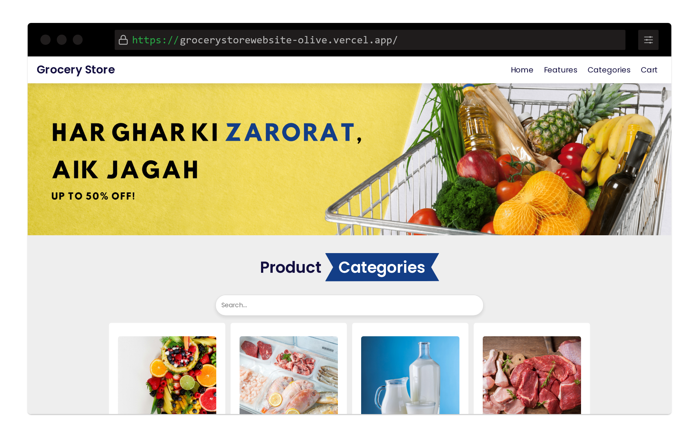

# Grocery Store Website

A clean, responsive grocery store website built with pure HTML and CSS - no JavaScript required.
<div align="center">

[](https://grocerystorewebsite-olive.vercel.app/)

</div>


## Features
- 🛒 Full product catalog with categories
- 🎨 Modern, clean interface
- ⚡ Fast loading (no JS dependencies)
- ♿ Accessible navigation

## Screenshots

**Home Page:**


**Product Catalog:**
<!--  -->

## What I Learned
- **Semantic HTML5** for better accessibility and SEO
- **CSS Grid & Flexbox** for complex layouts
- **Responsive design** principles that work on all devices
- **CSS variables** for consistent theming
- **Form styling** without JavaScript validation
- **Performance optimization** by avoiding JavaScript bloat
- **Cross-browser compatibility** techniques

## Project Structure
```
grocery-store/
├── index.html          # Homepage
├── products.html       # Product catalog
├── categories.html     # Product categories
├── featres.html        # Brand Features
├── cart.html           # Cart
├── style.css           # Main stylesheet
├── image/              # Product images
└── README.md
```

## Technologies Used
- HTML5
- CSS3 (Grid, Flexbox, Variables)
- Responsive Design
- Accessibility Best Practices
